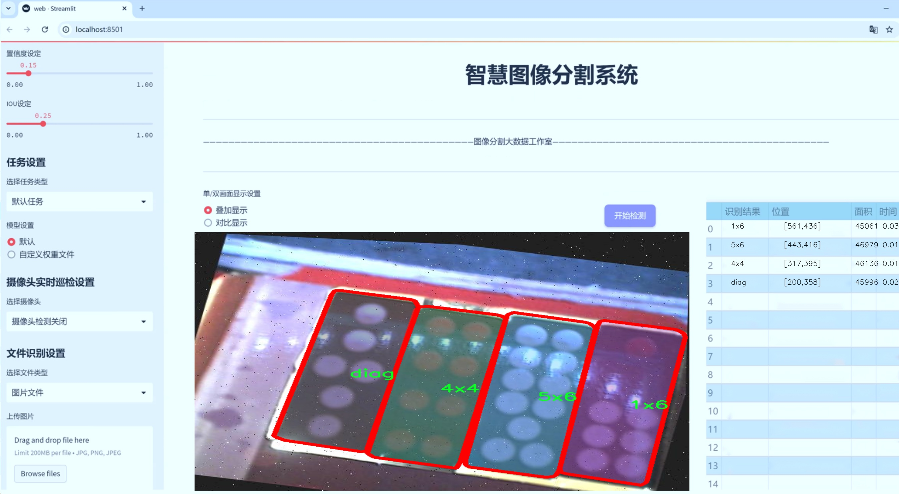
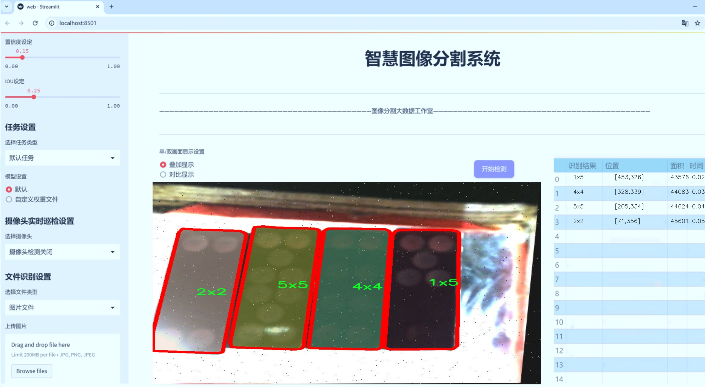
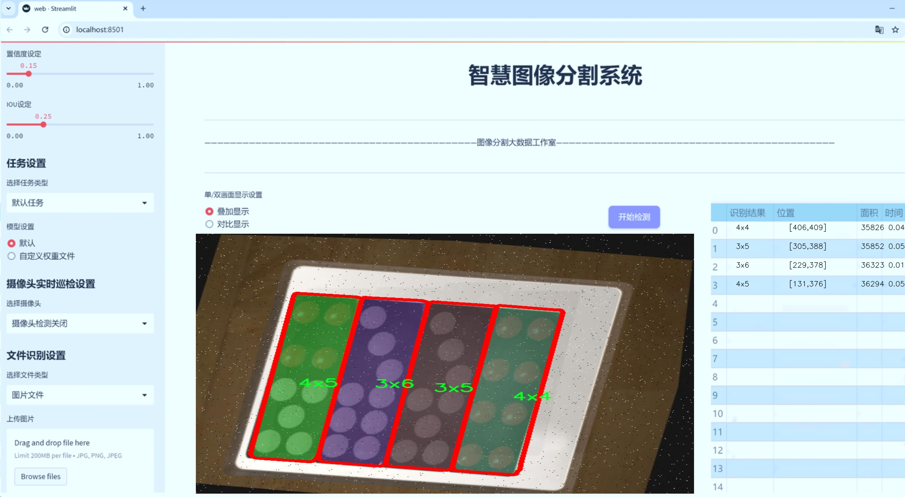
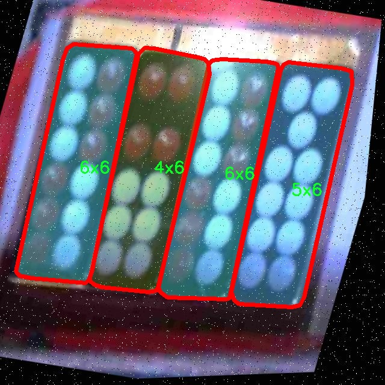
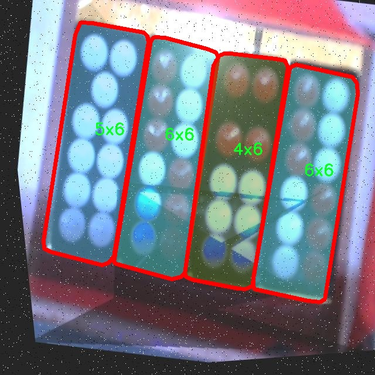
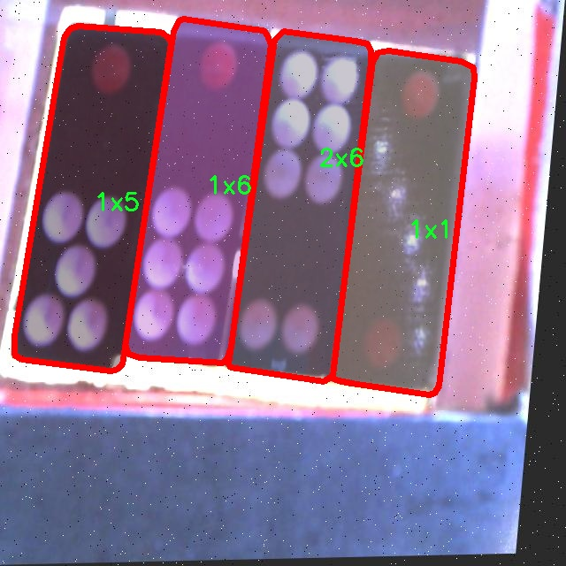
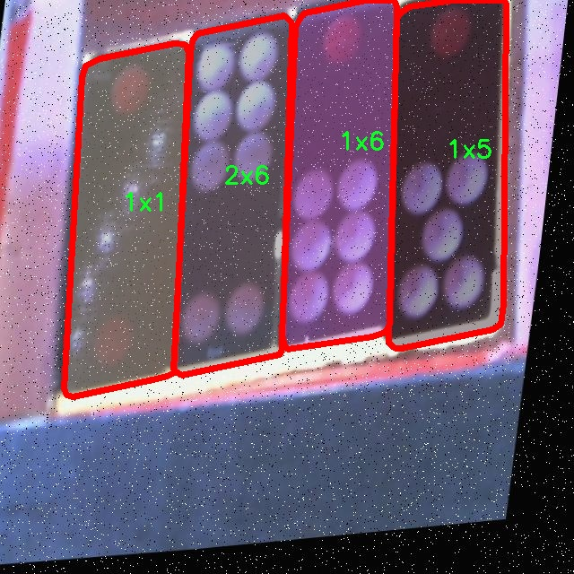
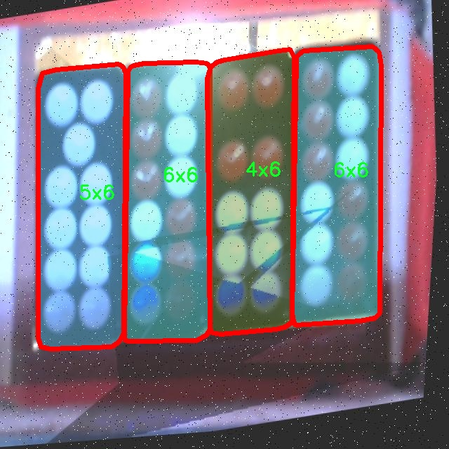

# 牌九识别分割系统源码＆数据集分享
 [yolov8-seg-p6＆yolov8-seg-C2f-DCNV3等50+全套改进创新点发刊_一键训练教程_Web前端展示]

### 1.研究背景与意义

项目参考[ILSVRC ImageNet Large Scale Visual Recognition Challenge](https://gitee.com/YOLOv8_YOLOv11_Segmentation_Studio/projects)

项目来源[AAAI Global Al lnnovation Contest](https://kdocs.cn/l/cszuIiCKVNis)

研究背景与意义

随着人工智能技术的迅猛发展，计算机视觉领域的研究不断深入，尤其是在物体检测与分割方面，已经取得了显著的进展。YOLO（You Only Look Once）系列模型因其高效的实时性和准确性，成为了物体检测领域的佼佼者。近年来，YOLOv8作为该系列的最新版本，在模型架构和性能上进行了多项改进，极大地提升了目标检测的精度和速度。然而，针对特定应用场景的定制化需求仍然存在，尤其是在复杂背景下的细粒度物体识别与分割任务中。

牌九作为一种传统的中国棋牌游戏，其牌面图案复杂多样，且具有一定的重叠性和相似性，这给牌九的自动识别与分割带来了挑战。传统的图像处理方法在处理这类复杂图案时，往往难以达到理想的效果。因此，基于改进YOLOv8的牌九识别分割系统的研究具有重要的现实意义和应用价值。

本研究将构建一个基于改进YOLOv8的牌九识别分割系统，利用pt-seg-synthetic数据集进行训练和验证。该数据集包含3200张图像，涵盖21个类别的牌九图案，包括1x1至6x6的各种组合以及对角牌型。这些数据的多样性和丰富性为模型的训练提供了良好的基础，使其能够在不同的场景和条件下进行有效的识别与分割。

在实际应用中，牌九识别系统可以广泛应用于在线棋牌游戏平台、智能桌面游戏设备以及相关的娱乐行业。通过实现自动化的牌九识别与分割，不仅可以提高游戏的智能化水平，还能提升用户体验，减少人工干预的需求。此外，该系统的成功实现也将为其他类似图案识别任务提供借鉴，推动计算机视觉技术在更广泛领域的应用。

从学术角度来看，本研究将对YOLOv8模型进行改进，以适应牌九图案的特征，探索深度学习在复杂图案识别中的新方法。这不仅有助于丰富目标检测与分割的理论体系，还将为未来的研究提供新的思路和方向。通过对模型的优化与改进，期望能够在保证实时性的同时，提升识别的准确率，为后续的研究奠定坚实的基础。

综上所述，基于改进YOLOv8的牌九识别分割系统的研究，不仅具有重要的应用价值，也为计算机视觉领域的理论研究提供了新的视角与挑战。通过深入探索这一领域，我们希望能够推动智能识别技术的发展，为实现更智能化的游戏体验贡献力量。

### 2.图片演示







##### 注意：由于此博客编辑较早，上面“2.图片演示”和“3.视频演示”展示的系统图片或者视频可能为老版本，新版本在老版本的基础上升级如下：（实际效果以升级的新版本为准）

  （1）适配了YOLOV8的“目标检测”模型和“实例分割”模型，通过加载相应的权重（.pt）文件即可自适应加载模型。

  （2）支持“图片识别”、“视频识别”、“摄像头实时识别”三种识别模式。

  （3）支持“图片识别”、“视频识别”、“摄像头实时识别”三种识别结果保存导出，解决手动导出（容易卡顿出现爆内存）存在的问题，识别完自动保存结果并导出到tempDir中。

  （4）支持Web前端系统中的标题、背景图等自定义修改，后面提供修改教程。

  另外本项目提供训练的数据集和训练教程,暂不提供权重文件（best.pt）,需要您按照教程进行训练后实现图片演示和Web前端界面演示的效果。

### 3.视频演示

[3.1 视频演示](https://www.bilibili.com/video/BV1pY2HY9EP7/)

### 4.数据集信息展示

##### 4.1 本项目数据集详细数据（类别数＆类别名）

nc: 21
names: ['1x1', '1x2', '1x3', '1x4', '1x5', '1x6', '2x2', '2x3', '2x4', '2x5', '2x6', '3x4', '3x5', '3x6', '4x4', '4x5', '4x6', '5x5', '5x6', '6x6', 'diag']


##### 4.2 本项目数据集信息介绍

数据集信息展示

在本研究中，我们采用了名为“pt-seg-synthetic”的数据集，以支持改进YOLOv8-seg的牌九识别分割系统的训练与评估。该数据集的设计旨在提供丰富的样本，以便于模型在复杂的牌九图像中进行准确的识别和分割。数据集包含21个类别，具体类别包括：'1x1', '1x2', '1x3', '1x4', '1x5', '1x6', '2x2', '2x3', '2x4', '2x5', '2x6', '3x4', '3x5', '3x6', '4x4', '4x5', '4x6', '5x5', '5x6', '6x6'以及'diag'。这些类别涵盖了牌九的各种组合形式，能够有效地反映出牌九游戏中的多样性和复杂性。

“pt-seg-synthetic”数据集的构建过程充分考虑了牌九的视觉特征与结构特征。每个类别的样本均经过精心设计，确保在不同的光照条件、角度和背景下，模型能够获得足够的训练信息。这种多样性不仅增强了模型的鲁棒性，还提升了其在实际应用中的表现。数据集中的每一张图像都配有相应的标注信息，标注格式遵循YOLO系列模型的标准，使得数据的处理和模型的训练过程更加高效。

为了进一步提高模型的泛化能力，数据集中还包含了一些合成的图像，这些图像通过计算机生成技术模拟了不同的牌九场景。这种合成数据的引入，使得模型在面对真实世界中的复杂情况时，能够更好地适应和应对。通过对合成数据的有效利用，我们希望模型能够在不同的环境下，依然保持高水平的识别精度。

此外，数据集的类别设计也充分考虑了牌九的游戏规则和玩法。例如，'diag'类别的引入，旨在帮助模型识别牌九中可能出现的特殊组合。这种设计不仅丰富了数据集的内容，也为模型的训练提供了更多的挑战和机遇。通过对这些类别的深入学习，模型能够在实际应用中实现更为精准的分割与识别，进而提升牌九游戏的智能化水平。

在数据集的使用过程中，我们将采用多种数据增强技术，以进一步提升模型的性能。这些技术包括随机裁剪、旋转、缩放以及颜色变换等，旨在模拟现实环境中的各种变化，从而增强模型的适应性和稳定性。通过这种方式，我们希望“pt-seg-synthetic”数据集能够为改进YOLOv8-seg的牌九识别分割系统提供强有力的支持，使其在实际应用中能够实现更高的识别率和更低的误识别率。

综上所述，“pt-seg-synthetic”数据集不仅在类别设计上具有针对性和多样性，还在数据生成和增强技术上进行了深入探索，为牌九识别分割系统的训练提供了坚实的基础。通过充分利用该数据集，我们期待在牌九识别领域取得突破性进展，推动智能化牌九游戏的发展。











### 5.全套项目环境部署视频教程（零基础手把手教学）

[5.1 环境部署教程链接（零基础手把手教学）](https://www.bilibili.com/video/BV1jG4Ve4E9t/?vd_source=bc9aec86d164b67a7004b996143742dc)


[5.2 安装Python虚拟环境创建和依赖库安装视频教程链接（零基础手把手教学）](https://www.bilibili.com/video/BV1nA4VeYEze/?vd_source=bc9aec86d164b67a7004b996143742dc)

### 6.手把手YOLOV8-seg训练视频教程（零基础小白有手就能学会）

[6.1 手把手YOLOV8-seg训练视频教程（零基础小白有手就能学会）](https://www.bilibili.com/video/BV1cA4VeYETe/?vd_source=bc9aec86d164b67a7004b996143742dc)


按照上面的训练视频教程链接加载项目提供的数据集，运行train.py即可开始训练



     Epoch   gpu_mem       box       obj       cls    labels  img_size
     1/200     0G   0.01576   0.01955  0.007536        22      1280: 100%|██████████| 849/849 [14:42<00:00,  1.04s/it]
               Class     Images     Labels          P          R     mAP@.5 mAP@.5:.95: 100%|██████████| 213/213 [01:14<00:00,  2.87it/s]
                 all       3395      17314      0.994      0.957      0.0957      0.0843

     Epoch   gpu_mem       box       obj       cls    labels  img_size
     2/200     0G   0.01578   0.01923  0.007006        22      1280: 100%|██████████| 849/849 [14:44<00:00,  1.04s/it]
               Class     Images     Labels          P          R     mAP@.5 mAP@.5:.95: 100%|██████████| 213/213 [01:12<00:00,  2.95it/s]
                 all       3395      17314      0.996      0.956      0.0957      0.0845

     Epoch   gpu_mem       box       obj       cls    labels  img_size
     3/200     0G   0.01561    0.0191  0.006895        27      1280: 100%|██████████| 849/849 [10:56<00:00,  1.29it/s]
               Class     Images     Labels          P          R     mAP@.5 mAP@.5:.95: 100%|███████   | 187/213 [00:52<00:00,  4.04it/s]
                 all       3395      17314      0.996      0.957      0.0957      0.0845


### 7.50+种全套YOLOV8-seg创新点代码加载调参视频教程（一键加载写好的改进模型的配置文件）

[7.1 50+种全套YOLOV8-seg创新点代码加载调参视频教程（一键加载写好的改进模型的配置文件）](https://www.bilibili.com/video/BV1Hw4VePEXv/?vd_source=bc9aec86d164b67a7004b996143742dc)

### 8.YOLOV8-seg图像分割算法原理

原始YOLOv8-seg算法原理

YOLOv8-seg算法是YOLO系列的最新进展，基于YOLOv8的目标检测框架，进一步扩展了图像分割的能力。YOLOv8的设计理念是通过高效的卷积神经网络结构，实时地对图像进行目标检测和分割。该算法的核心在于其独特的网络架构和训练策略，旨在提高检测精度和分割效果，同时保持较高的处理速度。

首先，YOLOv8-seg算法在数据预处理方面延续了YOLOv5的成功经验，采用了多种数据增强技术，如马赛克增强、混合增强、空间扰动和颜色扰动。这些技术不仅丰富了训练数据集，还提高了模型的鲁棒性，使其能够在不同的环境和条件下表现出色。通过这些增强手段，YOLOv8-seg能够更好地适应复杂的场景，从而提升分割精度。

在网络结构方面，YOLOv8-seg引入了更深的卷积神经网络，采用了C2f模块替代了YOLOv5中的C3模块。C2f模块的设计使得网络在梯度回传时能够更有效地传递信息，增强了特征提取的能力。与C3模块相比，C2f模块具有更多的分支结构，能够更好地捕捉多尺度特征。这种设计不仅提高了模型的表现，还在分割任务中提供了更为丰富的上下文信息，使得分割结果更加精准。

YOLOv8-seg还采用了特征金字塔网络（FPN）和路径聚合网络（PAN）结构，以实现多尺度信息的有效融合。FPN和PAN的结合使得模型能够在不同的尺度上提取特征，从而更好地处理大小不一的目标。这一结构的引入对于分割任务尤为重要，因为在实际应用中，目标的大小和形状各异，只有通过多尺度特征的融合，才能实现高质量的分割效果。

在检测头的设计上，YOLOv8-seg采用了解耦合头结构，这一创新使得分类和定位任务可以独立进行。通过将这两个任务分开处理，YOLOv8-seg能够更专注于每个任务的优化，从而提高整体性能。此外，YOLOv8-seg还引入了动态标签分配策略，解决了正负样本匹配的问题。这一策略使得模型在训练过程中能够更有效地学习到目标的特征，提升了分割的准确性。

在损失函数的设计上，YOLOv8-seg采用了Varifocal Loss（VFL）作为分类损失，并结合CIoU Loss和DFL Loss作为回归损失。VFL的引入使得模型在处理正负样本时能够进行更为精细的加权，从而提升了对高质量样本的关注度。这种损失函数的设计理念在于，通过强化对高质量样本的学习，进而提高整体的检测和分割性能。

YOLOv8-seg的另一大亮点在于其灵活的模型架构。根据不同的应用需求，YOLOv8-seg提供了多种模型规模，从轻量级到重型模型应有尽有。这种灵活性使得YOLOv8-seg能够广泛应用于智能监控、自动驾驶、医疗影像分析等多个领域，满足不同场景下的需求。

综上所述，YOLOv8-seg算法在YOLOv8的基础上，通过改进网络结构、优化训练策略和设计高效的损失函数，显著提升了目标检测和图像分割的性能。其在处理速度和精度上的双重优势，使得YOLOv8-seg成为了当前图像分割领域的重要工具，能够在多种复杂场景中实现高效的目标分割。随着技术的不断进步，YOLOv8-seg有望在未来的应用中发挥更大的作用，推动计算机视觉领域的发展。


### 9.系统功能展示（检测对象为举例，实际内容以本项目数据集为准）

图9.1.系统支持检测结果表格显示

  图9.2.系统支持置信度和IOU阈值手动调节

  图9.3.系统支持自定义加载权重文件best.pt(需要你通过步骤5中训练获得)

  图9.4.系统支持摄像头实时识别

  图9.5.系统支持图片识别

  图9.6.系统支持视频识别

  图9.7.系统支持识别结果文件自动保存

  图9.8.系统支持Excel导出检测结果数据


### 10.50+种全套YOLOV8-seg创新点原理讲解（非科班也可以轻松写刊发刊，V11版本正在科研待更新）

#### 10.1 由于篇幅限制，每个创新点的具体原理讲解就不一一展开，具体见下列网址中的创新点对应子项目的技术原理博客网址【Blog】：


[10.1 50+种全套YOLOV8-seg创新点原理讲解链接](https://gitee.com/qunmasj/good)

#### 10.2 部分改进模块原理讲解(完整的改进原理见上图和技术博客链接)【此小节的图要是加载失败请移步原始博客查看，链接：https://blog.csdn.net/cheng2333333?type=blog】
### YOLOv8简介
YOLO（You Only Look Once）是一种流行的对象检测和图像分割模型，由华盛顿大学的Joseph Redmon和Ali Farhadi开发。YOLO于2015年推出，以其高速度和高精度迅速走红。

YOLOv2于2016年发布，通过合并批处理规范化、锚盒和维度集群来改进原始模型
2018年推出的YOLOv3使用更高效的骨干网络、多个锚点和空间金字塔池进一步增强了该模型的性能
YOLOv4于2020年发布，引入了Mosaic数据增强、新的无锚检测头和新的丢失功能等创新
YOLOv5进一步提高了模型的性能，并添加了超参数优化、集成实验跟踪和自动导出到流行导出格式等新功能
YOLOv6于2022年由美团开源，目前正在该公司的许多自动配送机器人中使用
YOLOv7在COCO关键点数据集上添加了额外的任务，如姿态估计
YOLOv8是Ultralytics公司推出的YOLO的最新版本。作为一款尖端、最先进的（SOTA）车型，YOLOv8在之前版本的成功基础上，引入了新的功能和改进，以增强性能、灵活性和效率。YOLOv8支持全方位的视觉AI任务，包括检测、分割、姿态估计、跟踪和分类。这种多功能性允许用户在不同的应用程序和域中利用YOLOv8的功能
#### YOLOv8的新特性与可用模型

Ultralytics 并没有直接将开源库命名为 YOLOv8，而是直接使用 ultralytics 这个词，原因是 ultralytics 将这个库定位为算法框架，而非某一个特定算法，一个主要特点是可扩展性。其希望这个库不仅仅能够用于 YOLO 系列模型，而是能够支持非 YOLO 模型以及分类分割姿态估计等各类任务。总而言之，ultralytics 开源库的两个主要优点是：

融合众多当前 SOTA 技术于一体
未来将支持其他 YOLO 系列以及 YOLO 之外的更多算法
Ultralytics为YOLO模型发布了一个全新的存储库。它被构建为 用于训练对象检测、实例分割和图像分类模型的统一框架。

提供了一个全新的 SOTA 模型，包括 P5 640 和 P6 1280 分辨率的目标检测网络和基于 YOLACT 的实例分割模型。和 YOLOv5 一样，基于缩放系数也提供了 N/S/M/L/X 尺度的不同大小模型，用于满足不同场景需求
骨干网络和 Neck 部分可能参考了 YOLOv7 ELAN 设计思想，将 YOLOv5 的 C3 结构换成了梯度流更丰富的 C2f 结构，并对不同尺度模型调整了不同的通道数，属于对模型结构精心微调，不再是无脑一套参数应用所有模型，大幅提升了模型性能。不过这个 C2f 模块中存在 Split 等操作对特定硬件部署没有之前那么友好了
Head 部分相比 YOLOv5 改动较大，换成了目前主流的解耦头结构，将分类和检测头分离，同时也从 Anchor-Based 换成了 Anchor-Free
Loss 计算方面采用了 TaskAlignedAssigner 正样本分配策略，并引入了 Distribution Focal Loss
训练的数据增强部分引入了 YOLOX 中的最后 10 epoch 关闭 Mosiac 增强的操作，可以有效地提升精度
YOLOv8 还高效灵活地支持多种导出格式，并且该模型可以在 CPU 和 GPU 上运行。YOLOv8 模型的每个类别中有五个模型用于检测、分割和分类。YOLOv8 Nano 是最快和最小的，而 YOLOv8 Extra Large (YOLOv8x) 是其中最准确但最慢的。


### FocalModulation模型的基本原理
参考该博客，Focal Modulation Networks（FocalNets）的基本原理是替换自注意力（Self-Attention）模块，使用焦点调制（focal modulation）机制来捕捉图像中的长距离依赖和上下文信息。下图是自注意力和焦点调制两种方法的对比。


自注意力要求对每个查询令牌（Query Token）与其他令牌进行复杂的查询-键（Query-Key）交互和查询-值（Query-Value）聚合，以计算注意力分数并捕捉上下文。而焦点调制则先将空间上下文以不同粒度聚合到调制器中，然后以查询依赖的方式将这些调制器注入到查询令牌中。焦点调制简化了交互和聚合操作，使其更轻量级。在图中，自注意力部分使用红色虚线表示查询-键交互和黄色虚线表示查询-值聚合，而焦点调制部分则用蓝色表示调制器聚合和黄色表示查询-调制器交互。 

FocalModulation模型通过以下步骤实现：

1. 焦点上下文化：用深度卷积层堆叠来编码不同范围的视觉上下文。


2. 门控聚合：通过门控机制，选择性地将上下文信息聚合到每个查询令牌的调制器中。


3. 逐元素仿射变换：将聚合后的调制器通过仿射变换注入到每个查询令牌中。

下面来分别介绍这三个机制->

#### 焦点上下文化
焦点上下文化（Focal Contextualization）是焦点调制（Focal Modulation）的一个组成部分。焦点上下文化使用一系列深度卷积层（depth-wise convolutional layers）来编码不同范围内的视觉上下文信息。这些层可以捕捉从近处到远处的视觉特征，从而允许网络在不同层次上理解图像内容。通过这种方式，网络能够在聚合上下文信息时保持对局部细节的敏感性，并增强对全局结构的认识。


​

这张图详细比较了自注意力（Self-Attention, SA）和焦点调制（Focal Modulation）的机制，并特别展示了焦点调制中的上下文聚合过程。左侧的图展示了自注意力模型如何通过键（k）和查询（q）之间的交互，以及随后的聚合来生成输出。而中间和右侧的图说明了焦点调制如何通过层级化的上下文聚合和门控聚合过程替代自注意力模型的这一过程。在焦点调制中，输入首先通过轻量级线性层进行处理，然后通过层级化的上下文化模块和门控机制来选择性地聚合信息，最终通过调制器与查询（q）进行交互以生成输出。

#### 门控聚合
在Focal Modulation Networks（FocalNets）中的 "门控聚合"（Gated Aggregation）是关键组件之一，这一过程涉及使用门控机制来选择性地聚合上下文信息。以下是这个过程的详细分析：

1. 什么是门控机制？
门控机制在深度学习中常用于控制信息流。它通常用于决定哪些信息应该被传递，哪些应该被阻断。在循环神经网络（RNN）中，特别是在长短期记忆网络（LSTM）和门控循环单元（GRU）中，门控机制用于调节信息在时间序列数据中的流动。

2. 门控聚合的目的
在FocalNets中，门控聚合的目的是为每个查询令牌（即处理中的数据单元）选择性地聚合上下文信息。这意味着网络能够决定哪些特定的上下文信息对于当前处理的查询令牌是重要的，从而专注于那些最相关的信息。

3. 如何实现门控聚合？
实现门控聚合可能涉及一系列计算步骤，其中包括：

计算上下文信息：这可能涉及使用深度卷积层（如文中提到的）对输入图像的不同区域进行编码，以捕捉从局部到全局的视觉上下文。
门控操作：这一步骤涉及到一个决策过程，根据当前查询令牌的特征来决定哪些上下文信息是相关的。这可能通过一个学习到的权重（门）来实现，该权重决定了不同上下文信息的重要性。
信息聚合：最后，根据门控操作的结果，选择性地聚合上下文信息到一个调制器中。这个调制器随后被用于调整或“调制”查询令牌的表示。
4. 门控聚合的好处
通过门控聚合，FocalNets能够更有效地聚焦于对当前任务最关键的信息。这种方法提高了模型的效率和性能，因为它减少了不必要信息的处理，同时增强了对关键特征的关注。在视觉任务中，这可能意味着更好的目标检测和图像分类性能，特别是在复杂或多变的视觉环境中。

总结：门控聚合是FocalNets的一个核心组成部分，它通过选择性地集中处理重要的上下文信息来提升网络的效率和性能。

#### 逐元素仿射变换
在Focal Modulation Networks（FocalNets）中的第三个关键组件是逐元素仿射变换，这个步骤涉及将通过门控聚合得到的调制器注入到每个查询令牌中。以下是该过程的详细分析：

1. 仿射变换的基本概念：
仿射变换是一种线性变换，用于对数据进行缩放、旋转、平移和倾斜等操作。在深度学习中，逐元素的仿射变换通常指的是对每个元素进行线性变换，这种变换可以被描述为y = ax + b，其中x是输入，y是输出，a和b是变换的参数。

2. 逐元素仿射变换的作用：
在FocalNets中，逐元素仿射变换的作用是将聚合后的调制器信息注入到每个查询令牌中。这个步骤对于整合上下文信息和查询令牌的原始特征非常重要。通过这种方式，调制器所包含的上下文信息可以直接影响查询令牌的表示。

3. 执行仿射变换：
执行这一步骤时，聚合后的调制器对每个查询令牌进行逐元素的仿射变换。在实践中，这可能意味着对查询令牌的每个特征应用调制器中的相应权重（a）和偏差（b）。这样，调制器中的每个元素都直接对应于查询令牌的一个特征，通过调整这些特征来改变其表达。

4. 仿射变换的效果：
通过逐元素仿射变换，模型能够更细致地调整每个查询令牌的特征，根据上下文信息来增强或抑制某些特征。这种精细的调整机制允许网络更好地适应复杂的视觉场景，提高对细节的捕捉能力，从而提升了模型在各种视觉任务中的性能，如目标检测和图像分类。

总结：逐元素仿射变换它使得模型能够利用上下文信息来有效地调整查询令牌，增强了模型对关键视觉特征的捕捉和表达能力。


### 11.项目核心源码讲解（再也不用担心看不懂代码逻辑）

#### 11.1 ultralytics\nn\backbone\efficientViT.py

以下是对给定代码的核心部分进行分析和注释，保留了最重要的类和方法，并添加了详细的中文注释。

```python
import torch
import torch.nn as nn
import torch.nn.functional as F
import itertools
from timm.models.layers import SqueezeExcite

# 定义 EfficientViT 模型的基本组件

class Conv2d_BN(torch.nn.Sequential):
    """带有批归一化的卷积层"""
    def __init__(self, in_channels, out_channels, kernel_size=1, stride=1, padding=0, dilation=1,
                 groups=1, bn_weight_init=1):
        super().__init__()
        # 添加卷积层
        self.add_module('c', torch.nn.Conv2d(
            in_channels, out_channels, kernel_size, stride, padding, dilation, groups, bias=False))
        # 添加批归一化层
        self.add_module('bn', torch.nn.BatchNorm2d(out_channels))
        # 初始化批归一化的权重
        torch.nn.init.constant_(self.bn.weight, bn_weight_init)
        torch.nn.init.constant_(self.bn.bias, 0)

    @torch.no_grad()
    def switch_to_deploy(self):
        """将模型切换到推理模式，合并卷积和批归一化层"""
        c, bn = self._modules.values()
        w = bn.weight / (bn.running_var + bn.eps)**0.5
        w = c.weight * w[:, None, None, None]
        b = bn.bias - bn.running_mean * bn.weight / (bn.running_var + bn.eps)**0.5
        m = torch.nn.Conv2d(w.size(1) * self.c.groups, w.size(0), w.shape[2:], stride=self.c.stride,
                             padding=self.c.padding, dilation=self.c.dilation, groups=self.c.groups)
        m.weight.data.copy_(w)
        m.bias.data.copy_(b)
        return m

class PatchMerging(torch.nn.Module):
    """将特征图进行合并的模块"""
    def __init__(self, dim, out_dim):
        super().__init__()
        hid_dim = int(dim * 4)  # 隐藏层维度
        self.conv1 = Conv2d_BN(dim, hid_dim, 1, 1, 0)
        self.act = torch.nn.ReLU()
        self.conv2 = Conv2d_BN(hid_dim, hid_dim, 3, 2, 1, groups=hid_dim)
        self.se = SqueezeExcite(hid_dim, .25)  # Squeeze-and-Excitation模块
        self.conv3 = Conv2d_BN(hid_dim, out_dim, 1, 1, 0)

    def forward(self, x):
        """前向传播"""
        x = self.conv3(self.se(self.act(self.conv2(self.act(self.conv1(x))))))
        return x

class FFN(torch.nn.Module):
    """前馈神经网络模块"""
    def __init__(self, ed, h):
        super().__init__()
        self.pw1 = Conv2d_BN(ed, h)  # 逐点卷积
        self.act = torch.nn.ReLU()
        self.pw2 = Conv2d_BN(h, ed, bn_weight_init=0)  # 逐点卷积

    def forward(self, x):
        """前向传播"""
        x = self.pw2(self.act(self.pw1(x)))
        return x

class LocalWindowAttention(torch.nn.Module):
    """局部窗口注意力机制"""
    def __init__(self, dim, key_dim, num_heads=8, window_resolution=7):
        super().__init__()
        self.attn = CascadedGroupAttention(dim, key_dim, num_heads, resolution=window_resolution)

    def forward(self, x):
        """前向传播"""
        B, C, H, W = x.shape
        # 处理输入图像的大小
        if H <= self.window_resolution and W <= self.window_resolution:
            x = self.attn(x)
        else:
            # 对输入进行填充和分块处理
            x = x.permute(0, 2, 3, 1)
            pad_b = (self.window_resolution - H % self.window_resolution) % self.window_resolution
            pad_r = (self.window_resolution - W % self.window_resolution) % self.window_resolution
            if pad_b > 0 or pad_r > 0:
                x = F.pad(x, (0, 0, 0, pad_r, 0, pad_b))

            pH, pW = H + pad_b, W + pad_r
            nH = pH // self.window_resolution
            nW = pW // self.window_resolution
            # 窗口分块
            x = x.view(B, nH, self.window_resolution, nW, self.window_resolution, C).transpose(2, 3).reshape(
                B * nH * nW, self.window_resolution, self.window_resolution, C
            ).permute(0, 3, 1, 2)
            x = self.attn(x)
            # 窗口反转
            x = x.permute(0, 2, 3, 1).view(B, nH, nW, self.window_resolution, self.window_resolution, C).transpose(2, 3).reshape(B, pH, pW, C)

            if pad_b > 0 or pad_r > 0:
                x = x[:, :H, :W].contiguous()

            x = x.permute(0, 3, 1, 2)

        return x

class EfficientViTBlock(torch.nn.Module):
    """EfficientViT的基本构建块"""
    def __init__(self, type, ed, kd, nh=8, ar=4):
        super().__init__()
        self.dw0 = Residual(Conv2d_BN(ed, ed, 3, 1, 1, groups=ed))
        self.ffn0 = Residual(FFN(ed, int(ed * 2)))

        if type == 's':
            self.mixer = Residual(LocalWindowAttention(ed, kd, nh, window_resolution=7))

        self.dw1 = Residual(Conv2d_BN(ed, ed, 3, 1, 1, groups=ed))
        self.ffn1 = Residual(FFN(ed, int(ed * 2)))

    def forward(self, x):
        """前向传播"""
        return self.ffn1(self.dw1(self.mixer(self.ffn0(self.dw0(x)))))

class EfficientViT(torch.nn.Module):
    """EfficientViT模型"""
    def __init__(self, img_size=400, patch_size=16, embed_dim=[64, 128, 192], depth=[1, 2, 3], num_heads=[4, 4, 4]):
        super().__init__()
        # 图像嵌入层
        self.patch_embed = torch.nn.Sequential(
            Conv2d_BN(3, embed_dim[0] // 8, 3, 2, 1), torch.nn.ReLU(),
            Conv2d_BN(embed_dim[0] // 8, embed_dim[0] // 4, 3, 2, 1), torch.nn.ReLU(),
            Conv2d_BN(embed_dim[0] // 4, embed_dim[0] // 2, 3, 2, 1), torch.nn.ReLU(),
            Conv2d_BN(embed_dim[0] // 2, embed_dim[0], 3, 1, 1)
        )

        # 构建各个块
        self.blocks = []
        for i, (ed, dpth, nh) in enumerate(zip(embed_dim, depth, num_heads)):
            for _ in range(dpth):
                self.blocks.append(EfficientViTBlock('s', ed, 16, nh))
        self.blocks = torch.nn.Sequential(*self.blocks)

    def forward(self, x):
        """前向传播"""
        x = self.patch_embed(x)
        x = self.blocks(x)
        return x

# 创建不同配置的 EfficientViT 模型
def EfficientViT_M0():
    return EfficientViT(embed_dim=[64, 128, 192], depth=[1, 2, 3], num_heads=[4, 4, 4])

# 主程序入口
if __name__ == '__main__':
    model = EfficientViT_M0()
    inputs = torch.randn((1, 3, 640, 640))  # 随机输入
    res = model(inputs)  # 前向传播
    print(res.size())  # 输出结果的尺寸
```

### 代码核心部分说明：
1. **Conv2d_BN**: 带有批归一化的卷积层，包含了卷积和批归一化的组合，提供了一个方法来将这两者合并以提高推理速度。
2. **PatchMerging**: 负责将特征图进行合并，增加了模型的表达能力。
3. **FFN**: 前馈神经网络模块，使用逐点卷积和激活函数。
4. **LocalWindowAttention**: 实现局部窗口注意力机制，增强了模型对局部特征的关注。
5. **EfficientViTBlock**: EfficientViT的基本构建块，组合了卷积、前馈网络和注意力机制。
6. **EfficientViT**: 整个模型的实现，包含了图像嵌入和多个构建块的堆叠。

以上代码提供了一个高效的视觉Transformer架构，适用于各种下游任务。

这个文件实现了一个名为EfficientViT的深度学习模型，主要用于计算机视觉任务。EfficientViT是基于视觉变换器（Vision Transformer）架构的高效变体，旨在提高模型的性能和计算效率。文件中包含了多个类和函数，下面是对其主要内容的详细说明。

首先，文件导入了必要的库，包括PyTorch和一些用于构建神经网络的模块。接着，定义了一个名为`Conv2d_BN`的类，该类是一个组合模块，包含卷积层和批归一化层。它在初始化时设置了卷积层的参数，并对批归一化层的权重进行了初始化。该类还提供了一个`switch_to_deploy`方法，用于在推理阶段将卷积和批归一化层融合为一个卷积层，以提高推理速度。

接下来，`replace_batchnorm`函数用于遍历网络中的所有子模块，将批归一化层替换为恒等映射，以减少推理时的计算量。

`PatchMerging`类实现了一个用于合并图像块的模块，主要通过卷积和激活函数来处理输入特征图，并使用Squeeze-and-Excitation机制来增强特征表示。

`Residual`类定义了一个残差连接模块，可以在训练过程中根据设定的丢弃率随机丢弃部分输入，以增强模型的鲁棒性。

`FFN`类实现了一个前馈神经网络模块，包含两个卷积层和一个ReLU激活函数，用于特征的非线性变换。

`CascadedGroupAttention`和`LocalWindowAttention`类实现了不同类型的注意力机制。前者是级联组注意力，后者是局部窗口注意力。它们都使用卷积层来处理输入特征，并计算注意力权重以加权输入特征，从而提取重要信息。

`EfficientViTBlock`类是EfficientViT的基本构建块，结合了卷积、前馈网络和注意力机制。它的设计使得模型能够在不同的层次上提取特征。

`EfficientViT`类是整个模型的核心，负责构建网络的各个部分，包括图像块嵌入、多个EfficientViT块以及特征的逐层处理。该类的初始化函数接收多个参数，以便灵活配置模型的结构。

在文件的最后部分，定义了一些预设的模型配置（如`EfficientViT_m0`到`EfficientViT_m5`），这些配置包含了不同的超参数设置，如图像大小、嵌入维度、深度等。还定义了一些函数（如`EfficientViT_M0`等），用于创建模型实例并加载预训练权重。

最后，文件的主程序部分创建了一个EfficientViT模型实例，并对随机生成的输入进行前向传播，输出各层的特征图尺寸。这部分代码主要用于测试模型的构建和功能。

总的来说，这个文件实现了一个高效的视觉变换器模型，包含了多个模块和功能，旨在提高计算机视觉任务的性能和效率。

#### 11.2 ui.py

以下是代码中最核心的部分，并附上详细的中文注释：

```python
import sys
import subprocess

def run_script(script_path):
    """
    使用当前 Python 环境运行指定的脚本。

    Args:
        script_path (str): 要运行的脚本路径

    Returns:
        None
    """
    # 获取当前 Python 解释器的路径
    python_path = sys.executable

    # 构建运行命令，使用 streamlit 运行指定的脚本
    command = f'"{python_path}" -m streamlit run "{script_path}"'

    # 执行命令
    result = subprocess.run(command, shell=True)
    # 检查命令执行的返回码，0 表示成功，非 0 表示出错
    if result.returncode != 0:
        print("脚本运行出错。")

# 实例化并运行应用
if __name__ == "__main__":
    # 指定要运行的脚本路径
    script_path = "web.py"  # 这里可以直接指定脚本名，假设它在当前目录下

    # 调用函数运行脚本
    run_script(script_path)
```

### 代码注释说明：
1. **导入模块**：
   - `sys`：用于访问与 Python 解释器相关的变量和函数。
   - `subprocess`：用于创建新进程、连接到它们的输入/输出/错误管道，并获得它们的返回码。

2. **`run_script` 函数**：
   - 该函数接收一个脚本路径作为参数，并使用当前 Python 环境运行该脚本。
   - `python_path = sys.executable`：获取当前 Python 解释器的完整路径。
   - `command`：构建要执行的命令字符串，使用 `streamlit` 模块运行指定的脚本。
   - `subprocess.run(command, shell=True)`：执行构建的命令，`shell=True` 允许在 shell 中执行命令。
   - `result.returncode`：检查命令的返回码，以确定脚本是否成功运行。

3. **主程序块**：
   - `if __name__ == "__main__":`：确保只有在直接运行该脚本时才会执行以下代码。
   - `script_path = "web.py"`：指定要运行的脚本名称。
   - `run_script(script_path)`：调用 `run_script` 函数来执行指定的脚本。

这个程序文件名为 `ui.py`，主要功能是通过当前的 Python 环境运行一个指定的脚本。程序的核心部分是一个名为 `run_script` 的函数，它接受一个字符串参数 `script_path`，表示要运行的脚本的路径。

在 `run_script` 函数中，首先通过 `sys.executable` 获取当前 Python 解释器的路径。接着，构建一个命令字符串，使用 `streamlit` 模块来运行指定的脚本。具体的命令格式为 `"{python_path}" -m streamlit run "{script_path}"`，其中 `{python_path}` 和 `{script_path}` 分别被替换为当前 Python 解释器的路径和要运行的脚本路径。

然后，使用 `subprocess.run` 方法执行这个命令，`shell=True` 参数表示在 shell 中执行命令。执行完命令后，程序会检查返回的状态码，如果返回码不为 0，表示脚本运行过程中出现了错误，此时会打印出“脚本运行出错。”的提示信息。

在文件的最后部分，使用 `if __name__ == "__main__":` 语句来确保只有在直接运行该文件时才会执行以下代码。这里指定了要运行的脚本路径为 `web.py`，并调用 `abs_path` 函数来获取该脚本的绝对路径。最后，调用 `run_script` 函数来运行这个脚本。

总体来说，这个程序的主要目的是提供一个简单的接口来运行一个名为 `web.py` 的脚本，利用 `streamlit` 框架来展示 web 应用。

#### 11.3 ultralytics\nn\backbone\repvit.py

以下是提取后的核心代码部分，并添加了详细的中文注释：

```python
import torch.nn as nn
import torch

# 定义一个用于替换BatchNorm层的函数
def replace_batchnorm(net):
    for child_name, child in net.named_children():
        # 如果子模块有fuse_self方法，进行融合
        if hasattr(child, 'fuse_self'):
            fused = child.fuse_self()
            setattr(net, child_name, fused)
            replace_batchnorm(fused)
        # 如果子模块是BatchNorm2d，替换为Identity
        elif isinstance(child, torch.nn.BatchNorm2d):
            setattr(net, child_name, torch.nn.Identity())
        else:
            replace_batchnorm(child)

# 定义一个用于确保通道数可被8整除的函数
def _make_divisible(v, divisor, min_value=None):
    if min_value is None:
        min_value = divisor
    new_v = max(min_value, int(v + divisor / 2) // divisor * divisor)
    # 确保向下取整不会减少超过10%
    if new_v < 0.9 * v:
        new_v += divisor
    return new_v

# 定义一个卷积加BatchNorm的组合模块
class Conv2d_BN(torch.nn.Sequential):
    def __init__(self, a, b, ks=1, stride=1, pad=0, dilation=1, groups=1, bn_weight_init=1):
        super().__init__()
        # 添加卷积层
        self.add_module('c', torch.nn.Conv2d(a, b, ks, stride, pad, dilation, groups, bias=False))
        # 添加BatchNorm层
        self.add_module('bn', torch.nn.BatchNorm2d(b))
        # 初始化BatchNorm的权重
        torch.nn.init.constant_(self.bn.weight, bn_weight_init)
        torch.nn.init.constant_(self.bn.bias, 0)

    @torch.no_grad()
    def fuse_self(self):
        # 融合卷积和BatchNorm为一个卷积层
        c, bn = self._modules.values()
        w = bn.weight / (bn.running_var + bn.eps)**0.5
        w = c.weight * w[:, None, None, None]
        b = bn.bias - bn.running_mean * bn.weight / (bn.running_var + bn.eps)**0.5
        m = torch.nn.Conv2d(w.size(1) * self.c.groups, w.size(0), w.shape[2:], stride=self.c.stride, padding=self.c.padding, dilation=self.c.dilation, groups=self.c.groups)
        m.weight.data.copy_(w)
        m.bias.data.copy_(b)
        return m

# 定义残差模块
class Residual(torch.nn.Module):
    def __init__(self, m, drop=0.):
        super().__init__()
        self.m = m  # 残差部分
        self.drop = drop  # dropout概率

    def forward(self, x):
        # 训练时应用dropout
        if self.training and self.drop > 0:
            return x + self.m(x) * torch.rand(x.size(0), 1, 1, 1, device=x.device).ge_(self.drop).div(1 - self.drop).detach()
        else:
            return x + self.m(x)

    @torch.no_grad()
    def fuse_self(self):
        # 融合残差模块
        if isinstance(self.m, Conv2d_BN):
            m = self.m.fuse_self()
            identity = torch.ones(m.weight.shape[0], m.weight.shape[1], 1, 1)
            identity = torch.nn.functional.pad(identity, [1, 1, 1, 1])
            m.weight += identity.to(m.weight.device)
            return m
        else:
            return self

# 定义RepViTBlock模块
class RepViTBlock(nn.Module):
    def __init__(self, inp, hidden_dim, oup, kernel_size, stride, use_se, use_hs):
        super(RepViTBlock, self).__init__()
        assert stride in [1, 2]
        self.identity = stride == 1 and inp == oup  # 判断是否为身份映射
        assert(hidden_dim == 2 * inp)  # 确保隐藏维度是输入维度的两倍

        # 根据stride的不同构建不同的模块
        if stride == 2:
            self.token_mixer = nn.Sequential(
                Conv2d_BN(inp, inp, kernel_size, stride, (kernel_size - 1) // 2, groups=inp),
                nn.Identity() if not use_se else SqueezeExcite(inp, 0.25),
                Conv2d_BN(inp, oup, ks=1, stride=1, pad=0)
            )
            self.channel_mixer = Residual(nn.Sequential(
                Conv2d_BN(oup, 2 * oup, 1, 1, 0),
                nn.GELU() if use_hs else nn.GELU(),
                Conv2d_BN(2 * oup, oup, 1, 1, 0, bn_weight_init=0),
            ))
        else:
            assert(self.identity)
            self.token_mixer = nn.Sequential(
                RepVGGDW(inp),
                nn.Identity() if not use_se else SqueezeExcite(inp, 0.25),
            )
            self.channel_mixer = Residual(nn.Sequential(
                Conv2d_BN(inp, hidden_dim, 1, 1, 0),
                nn.GELU() if use_hs else nn.GELU(),
                Conv2d_BN(hidden_dim, oup, 1, 1, 0, bn_weight_init=0),
            ))

    def forward(self, x):
        return self.channel_mixer(self.token_mixer(x))

# 定义RepViT模型
class RepViT(nn.Module):
    def __init__(self, cfgs):
        super(RepViT, self).__init__()
        self.cfgs = cfgs  # 配置参数
        input_channel = self.cfgs[0][2]  # 输入通道数
        # 构建初始层
        patch_embed = torch.nn.Sequential(Conv2d_BN(3, input_channel // 2, 3, 2, 1), nn.GELU(),
                                           Conv2d_BN(input_channel // 2, input_channel, 3, 2, 1))
        layers = [patch_embed]
        # 构建反向残差块
        block = RepViTBlock
        for k, t, c, use_se, use_hs, s in self.cfgs:
            output_channel = _make_divisible(c, 8)
            exp_size = _make_divisible(input_channel * t, 8)
            layers.append(block(input_channel, exp_size, output_channel, k, s, use_se, use_hs))
            input_channel = output_channel
        self.features = nn.ModuleList(layers)

    def forward(self, x):
        features = [None, None, None, None]
        for f in self.features:
            x = f(x)
            # 记录特征图
            if x.size(2) in [x.size(2) // 4, x.size(2) // 8, x.size(2) // 16, x.size(2) // 32]:
                features[x.size(2) // 4] = x
        return features

# 示例代码：构建RepViT模型并进行前向推理
if __name__ == '__main__':
    cfgs = [
        # k, t, c, SE, HS, s 
        [3, 2, 80, 1, 0, 1],
        [3, 2, 80, 0, 0, 1],
        # 省略其他配置...
    ]
    model = RepViT(cfgs)
    inputs = torch.randn((1, 3, 640, 640))  # 创建随机输入
    res = model(inputs)  # 前向推理
    for i in res:
        print(i.size())  # 输出特征图的尺寸
```

### 代码核心部分解释：
1. **replace_batchnorm**: 替换模型中的BatchNorm层为Identity层，以便在推理时提高性能。
2. **_make_divisible**: 确保通道数是8的倍数，以满足模型结构的要求。
3. **Conv2d_BN**: 自定义的卷积层和BatchNorm层的组合，支持权重初始化。
4. **Residual**: 残差连接模块，支持dropout。
5. **RepViTBlock**: 代表性ViT块，包含token混合和通道混合的逻辑。
6. **RepViT**: 主模型类，构建整个网络结构并实现前向传播。

这些模块共同构成了一个基于RepViT架构的深度学习模型，适用于图像处理任务。

这个程序文件定义了一个名为 `RepViT` 的深度学习模型，主要用于图像处理任务。该模型基于卷积神经网络（CNN）和视觉变换器（ViT）的架构，结合了残差连接和深度可分离卷积等技术，以提高模型的性能和效率。

首先，文件中导入了一些必要的库，包括 PyTorch 的神经网络模块 `torch.nn`、NumPy 以及 `timm` 库中的 `SqueezeExcite` 层。接着，定义了一些全局变量和函数。

`replace_batchnorm` 函数用于遍历网络中的所有子模块，将 BatchNorm2d 层替换为 Identity 层，以便在推理阶段提高计算效率。`_make_divisible` 函数确保网络中所有层的通道数都是 8 的倍数，这有助于在硬件上更高效地运行。

接下来，定义了几个类，包括 `Conv2d_BN`、`Residual`、`RepVGGDW`、`RepViTBlock` 和 `RepViT`。`Conv2d_BN` 类实现了一个带有 BatchNorm 的卷积层，并提供了一个融合方法 `fuse_self`，用于在推理时合并卷积和 BatchNorm 层。`Residual` 类实现了残差连接，并支持随机丢弃的功能。`RepVGGDW` 类则实现了深度可分离卷积的结构。

`RepViTBlock` 类是模型的基本构建块，结合了通道混合和标记混合的操作。`RepViT` 类则是整个模型的实现，负责构建网络的各个层，并定义前向传播的逻辑。模型的配置通过 `cfgs` 参数传入，具体定义了每个块的参数，如卷积核大小、扩展比例、输出通道数等。

在模型的前向传播中，输入数据经过一系列的卷积和激活函数处理，最终返回特征图。`switch_to_deploy` 方法用于将模型切换到推理模式，优化计算过程。

此外，文件中还定义了多个函数，如 `update_weight` 用于更新模型权重，`repvit_m0_9`、`repvit_m1_0` 等函数用于构建不同版本的 RepViT 模型，并可以加载预训练权重。

最后，在 `__main__` 块中，创建了一个 `RepViT` 模型实例，并通过随机生成的输入数据进行测试，输出每个特征图的尺寸。这一部分主要用于验证模型的构建和前向传播是否正常。整体来看，这个文件实现了一个高效的图像处理模型，适用于各种计算机视觉任务。

#### 11.4 train.py

以下是经过简化和注释的核心代码部分：

```python
import os
import torch
import yaml
from ultralytics import YOLO  # 导入YOLO模型库

if __name__ == '__main__':  # 确保该模块被直接运行时才执行以下代码
    # 设置训练参数
    workers = 1  # 数据加载的工作进程数
    batch = 8  # 每个批次的样本数量
    device = "0" if torch.cuda.is_available() else "cpu"  # 判断是否使用GPU

    # 获取数据集配置文件的绝对路径
    data_path = abs_path(f'datasets/data/data.yaml', path_type='current')

    # 将路径格式转换为Unix风格
    unix_style_path = data_path.replace(os.sep, '/')
    # 获取数据集目录路径
    directory_path = os.path.dirname(unix_style_path)

    # 读取YAML文件，保持原有顺序
    with open(data_path, 'r') as file:
        data = yaml.load(file, Loader=yaml.FullLoader)

    # 修改数据集路径
    if 'train' in data and 'val' in data and 'test' in data:
        data['train'] = directory_path + '/train'  # 更新训练集路径
        data['val'] = directory_path + '/val'      # 更新验证集路径
        data['test'] = directory_path + '/test'    # 更新测试集路径

        # 将修改后的数据写回YAML文件
        with open(data_path, 'w') as file:
            yaml.safe_dump(data, file, sort_keys=False)

    # 加载YOLO模型配置和预训练权重
    model = YOLO(r"C:\codeseg\codenew\50+种YOLOv8算法改进源码大全和调试加载训练教程（非必要）\改进YOLOv8模型配置文件\yolov8-seg-C2f-Faster.yaml").load("./weights/yolov8s-seg.pt")

    # 开始训练模型
    results = model.train(
        data=data_path,  # 指定训练数据的配置文件路径
        device=device,  # 指定训练设备
        workers=workers,  # 数据加载的工作进程数
        imgsz=640,  # 输入图像的大小
        epochs=100,  # 训练的轮数
        batch=batch,  # 每个批次的样本数量
    )
```

### 代码注释说明：
1. **导入库**：导入必要的库，包括操作系统、PyTorch、YAML解析库和YOLO模型库。
2. **主程序入口**：使用`if __name__ == '__main__':`确保代码块仅在直接运行时执行。
3. **设置训练参数**：定义数据加载的工作进程数、批次大小和设备类型（GPU或CPU）。
4. **获取数据集路径**：通过`abs_path`函数获取数据集配置文件的绝对路径，并转换为Unix风格路径。
5. **读取和修改YAML文件**：读取YAML文件，更新训练、验证和测试集的路径，并将修改后的内容写回文件。
6. **加载YOLO模型**：使用指定的配置文件和预训练权重加载YOLO模型。
7. **训练模型**：调用`model.train`方法开始训练，传入数据路径、设备、工作进程数、图像大小、训练轮数和批次大小等参数。

该程序文件 `train.py` 是一个用于训练 YOLO（You Only Look Once）模型的脚本。首先，它导入了必要的库，包括操作系统相关的 `os`、深度学习框架 `torch`、YAML 文件处理库 `yaml` 以及 YOLO 模型的实现 `ultralytics`。同时，它还设置了 matplotlib 的后端为 TkAgg，以便于图形界面的显示。

在 `__main__` 块中，程序首先定义了一些训练参数，包括工作进程数 `workers`、批次大小 `batch` 和设备类型 `device`。设备类型的选择是基于是否有可用的 GPU（CUDA）。接着，程序通过 `abs_path` 函数获取数据集配置文件的绝对路径，该配置文件是一个 YAML 格式的文件，包含了训练、验证和测试数据的路径。

程序随后将路径中的分隔符统一为 Unix 风格，并提取出目录路径。接下来，它打开 YAML 文件并读取其中的数据。若 YAML 文件中包含 `train`、`val` 和 `test` 项，程序会将这些项的路径修改为相对于当前目录的路径，并将修改后的数据写回 YAML 文件。

在模型加载部分，程序指定了一个 YOLOv8 模型的配置文件，并加载了预训练的权重文件。用户可以根据需要选择不同的模型配置文件，以适应不同的硬件要求。

最后，程序调用 `model.train()` 方法开始训练模型，传入了训练数据的配置文件路径、设备类型、工作进程数、输入图像大小、训练的 epoch 数量以及批次大小等参数。这样，程序就完成了 YOLO 模型的训练准备和执行。

#### 11.5 ultralytics\trackers\__init__.py

以下是保留的核心代码部分，并添加了详细的中文注释：

```python
# 导入所需的跟踪器类
from .bot_sort import BOTSORT  # 导入BOTSORT类，用于目标跟踪
from .byte_tracker import BYTETracker  # 导入BYTETracker类，用于目标跟踪
from .track import register_tracker  # 导入注册跟踪器的函数

# 定义可供外部使用的模块成员
__all__ = 'register_tracker', 'BOTSORT', 'BYTETracker'  # 允许简化导入，指定哪些成员可以被外部访问
```

### 注释说明：
1. **导入部分**：
   - `from .bot_sort import BOTSORT`：从当前包中导入`BOTSORT`类，这个类通常用于实现一种特定的目标跟踪算法。
   - `from .byte_tracker import BYTETracker`：从当前包中导入`BYTETracker`类，另一种目标跟踪算法的实现。
   - `from .track import register_tracker`：从当前包中导入`register_tracker`函数，用于注册不同的跟踪器。

2. **`__all__`**：
   - `__all__`是一个特殊变量，用于定义模块的公共接口。它指定了当使用`from module import *`时，哪些成员会被导入。在这里，`register_tracker`、`BOTSORT`和`BYTETracker`被指定为可供外部使用的成员。这样可以简化导入，避免不必要的命名冲突。

这个程序文件是一个 Python 模块的初始化文件，通常用于定义模块的公共接口。在这个文件中，首先通过注释标明了该模块属于 Ultralytics YOLO 项目，并且使用了 AGPL-3.0 许可证。

接下来，文件从同一目录下导入了三个组件：`BOTSORT`、`BYTETracker` 和 `register_tracker`。这些组件可能是用于目标跟踪的不同算法或工具，分别来自于 `bot_sort` 和 `byte_tracker` 模块，以及一个用于注册跟踪器的函数 `register_tracker`。

最后，`__all__` 变量被定义为一个包含字符串的元组，列出了模块的公共接口。这意味着当使用 `from ultralytics.trackers import *` 这种方式导入模块时，只会导入 `register_tracker`、`BOTSORT` 和 `BYTETracker` 这三个对象。这种做法有助于控制模块的命名空间，避免不必要的名称冲突，并使得模块的使用更加简洁和清晰。

#### 11.6 ultralytics\models\sam\modules\__init__.py

以下是代码的核心部分，并附上详细的中文注释：

```python
# Ultralytics YOLO 🚀, AGPL-3.0 license

# YOLO（You Only Look Once）是一种实时目标检测算法
# Ultralytics 是 YOLO 的一个实现，具有高效性和易用性

# 导入必要的库
import torch  # 导入 PyTorch 库，用于深度学习模型的构建和训练

# 定义一个函数用于加载 YOLO 模型
def load_model(weights='yolov5s.pt'):
    """
    加载 YOLO 模型
    :param weights: 模型权重文件的路径，默认为 'yolov5s.pt'
    :return: 加载的模型
    """
    model = torch.hub.load('ultralytics/yolov5', 'custom', path=weights)  # 从 Ultralytics 的 GitHub 仓库加载模型
    return model

# 定义一个函数用于进行目标检测
def detect_objects(model, img):
    """
    使用加载的模型进行目标检测
    :param model: 加载的 YOLO 模型
    :param img: 输入图像，可以是文件路径或图像数组
    :return: 检测结果，包括边界框、置信度和类别
    """
    results = model(img)  # 使用模型对输入图像进行推理
    return results

# 示例用法
if __name__ == "__main__":
    model = load_model()  # 加载模型
    img_path = 'path/to/image.jpg'  # 输入图像的路径
    results = detect_objects(model, img_path)  # 进行目标检测
    results.print()  # 打印检测结果
```

### 代码说明：
1. **导入库**：首先导入了 `torch` 库，这是一个流行的深度学习框架，用于构建和训练神经网络。
2. **加载模型**：定义了 `load_model` 函数，该函数用于加载 YOLO 模型的权重。默认情况下，它加载的是 `yolov5s.pt` 权重文件。
3. **目标检测**：定义了 `detect_objects` 函数，该函数接受加载的模型和输入图像，并返回检测结果。模型会对输入图像进行推理，输出边界框、置信度和类别信息。
4. **示例用法**：在 `__main__` 块中，首先加载模型，然后指定输入图像的路径，最后调用目标检测函数并打印结果。

这个代码片段展示了如何使用 Ultralytics YOLO 模型进行目标检测的基本流程。

这个文件是Ultralytics YOLO项目的一部分，具体位于`ultralytics/models/sam/modules/__init__.py`。文件的开头包含了一行注释，指出该项目使用的是AGPL-3.0许可证，并且与Ultralytics YOLO相关。

在Python中，`__init__.py`文件的主要作用是将包含该文件的目录标识为一个包。这样，其他模块或脚本就可以通过导入该包来使用其中定义的类和函数。通常，`__init__.py`文件中可以包含初始化代码、导入其他模块或定义包的公共接口。

虽然在你提供的代码片段中只有一行注释，但在实际的`__init__.py`文件中，可能会有更多的代码，比如导入其他模块、定义常量或类等。这些内容将帮助用户更方便地使用该包的功能。

总的来说，这个文件是Ultralytics YOLO项目结构中的一个重要组成部分，确保了该模块可以被正确识别和使用。

### 12.系统整体结构（节选）

### 整体功能和构架概括

Ultralytics YOLO项目是一个用于目标检测和计算机视觉任务的深度学习框架。该框架的核心功能包括模型的定义、训练、推理和目标跟踪。项目结构分为多个模块，每个模块负责特定的功能。以下是对主要模块的概述：

- **模型定义**：包括不同类型的神经网络架构，如EfficientViT、RepViT和LSKNet等，这些模型用于特征提取和目标检测。
- **训练和推理**：提供训练脚本和工具，以便用户可以方便地训练模型并进行推理。
- **目标跟踪**：实现了多种目标跟踪算法，如BOTSORT和BYTETracker，支持在视频流中对目标进行跟踪。
- **工具和实用程序**：包括各种实用工具，如度量计算、自动批处理、回调函数等，帮助用户更高效地使用框架。

### 文件功能整理表

| 文件路径                                           | 功能描述                                                   |
|---------------------------------------------------|------------------------------------------------------------|
| `ultralytics/nn/backbone/efficientViT.py`        | 实现EfficientViT模型，结合卷积和视觉变换器架构，用于图像处理任务。 |
| `ui.py`                                          | 提供一个接口来运行指定的Streamlit脚本，主要用于展示Web应用。     |
| `ultralytics/nn/backbone/repvit.py`              | 实现RepViT模型，结合卷积和视觉变换器的特性，用于高效的图像处理。  |
| `train.py`                                       | 训练YOLO模型的脚本，加载数据集配置，设置训练参数并开始训练。    |
| `ultralytics/trackers/__init__.py`               | 初始化目标跟踪模块，导入BOTSORT和BYTETracker等跟踪算法。       |
| `ultralytics/models/sam/modules/__init__.py`     | 初始化SAM模块，标识该目录为一个包，便于导入和使用。              |
| `ultralytics/engine/model.py`                    | 定义模型的训练和推理逻辑，处理模型的前向传播和损失计算。        |
| `ultralytics/utils/metrics.py`                   | 提供计算评估指标的功能，如精度、召回率等，用于模型性能评估。     |
| `ultralytics/nn/backbone/lsknet.py`              | 实现LSKNet模型，可能用于特定的图像处理任务。                    |
| `ultralytics/nn/extra_modules/afpn.py`           | 实现自适应特征金字塔网络（AFPN），用于增强特征提取能力。         |
| `ultralytics/engine/__init__.py`                 | 初始化引擎模块，标识该目录为一个包，便于导入和使用。              |
| `ultralytics/utils/autobatch.py`                 | 提供自动批处理功能，以优化训练过程中的内存使用和计算效率。      |
| `ultralytics/utils/callbacks/__init__.py`        | 初始化回调函数模块，提供训练过程中的回调功能。                  |

以上表格总结了每个文件的主要功能，展示了Ultralytics YOLO项目的模块化结构和各个组件的职责。

注意：由于此博客编辑较早，上面“11.项目核心源码讲解（再也不用担心看不懂代码逻辑）”中部分代码可能会优化升级，仅供参考学习，完整“训练源码”、“Web前端界面”和“50+种创新点源码”以“14.完整训练+Web前端界面+50+种创新点源码、数据集获取”的内容为准。

### 13.图片、视频、摄像头图像分割Demo(去除WebUI)代码

在这个博客小节中，我们将讨论如何在不使用WebUI的情况下，实现图像分割模型的使用。本项目代码已经优化整合，方便用户将分割功能嵌入自己的项目中。
核心功能包括图片、视频、摄像头图像的分割，ROI区域的轮廓提取、类别分类、周长计算、面积计算、圆度计算以及颜色提取等。
这些功能提供了良好的二次开发基础。

### 核心代码解读

以下是主要代码片段，我们会为每一块代码进行详细的批注解释：

```python
import random
import cv2
import numpy as np
from PIL import ImageFont, ImageDraw, Image
from hashlib import md5
from model import Web_Detector
from chinese_name_list import Label_list

# 根据名称生成颜色
def generate_color_based_on_name(name):
    ......

# 计算多边形面积
def calculate_polygon_area(points):
    return cv2.contourArea(points.astype(np.float32))

...
# 绘制中文标签
def draw_with_chinese(image, text, position, font_size=20, color=(255, 0, 0)):
    image_pil = Image.fromarray(cv2.cvtColor(image, cv2.COLOR_BGR2RGB))
    draw = ImageDraw.Draw(image_pil)
    font = ImageFont.truetype("simsun.ttc", font_size, encoding="unic")
    draw.text(position, text, font=font, fill=color)
    return cv2.cvtColor(np.array(image_pil), cv2.COLOR_RGB2BGR)

# 动态调整参数
def adjust_parameter(image_size, base_size=1000):
    max_size = max(image_size)
    return max_size / base_size

# 绘制检测结果
def draw_detections(image, info, alpha=0.2):
    name, bbox, conf, cls_id, mask = info['class_name'], info['bbox'], info['score'], info['class_id'], info['mask']
    adjust_param = adjust_parameter(image.shape[:2])
    spacing = int(20 * adjust_param)

    if mask is None:
        x1, y1, x2, y2 = bbox
        aim_frame_area = (x2 - x1) * (y2 - y1)
        cv2.rectangle(image, (x1, y1), (x2, y2), color=(0, 0, 255), thickness=int(3 * adjust_param))
        image = draw_with_chinese(image, name, (x1, y1 - int(30 * adjust_param)), font_size=int(35 * adjust_param))
        y_offset = int(50 * adjust_param)  # 类别名称上方绘制，其下方留出空间
    else:
        mask_points = np.concatenate(mask)
        aim_frame_area = calculate_polygon_area(mask_points)
        mask_color = generate_color_based_on_name(name)
        try:
            overlay = image.copy()
            cv2.fillPoly(overlay, [mask_points.astype(np.int32)], mask_color)
            image = cv2.addWeighted(overlay, 0.3, image, 0.7, 0)
            cv2.drawContours(image, [mask_points.astype(np.int32)], -1, (0, 0, 255), thickness=int(8 * adjust_param))

            # 计算面积、周长、圆度
            area = cv2.contourArea(mask_points.astype(np.int32))
            perimeter = cv2.arcLength(mask_points.astype(np.int32), True)
            ......

            # 计算色彩
            mask = np.zeros(image.shape[:2], dtype=np.uint8)
            cv2.drawContours(mask, [mask_points.astype(np.int32)], -1, 255, -1)
            color_points = cv2.findNonZero(mask)
            ......

            # 绘制类别名称
            x, y = np.min(mask_points, axis=0).astype(int)
            image = draw_with_chinese(image, name, (x, y - int(30 * adjust_param)), font_size=int(35 * adjust_param))
            y_offset = int(50 * adjust_param)

            # 绘制面积、周长、圆度和色彩值
            metrics = [("Area", area), ("Perimeter", perimeter), ("Circularity", circularity), ("Color", color_str)]
            for idx, (metric_name, metric_value) in enumerate(metrics):
                ......

    return image, aim_frame_area

# 处理每帧图像
def process_frame(model, image):
    pre_img = model.preprocess(image)
    pred = model.predict(pre_img)
    det = pred[0] if det is not None and len(det)
    if det:
        det_info = model.postprocess(pred)
        for info in det_info:
            image, _ = draw_detections(image, info)
    return image

if __name__ == "__main__":
    cls_name = Label_list
    model = Web_Detector()
    model.load_model("./weights/yolov8s-seg.pt")

    # 摄像头实时处理
    cap = cv2.VideoCapture(0)
    while cap.isOpened():
        ret, frame = cap.read()
        if not ret:
            break
        ......

    # 图片处理
    image_path = './icon/OIP.jpg'
    image = cv2.imread(image_path)
    if image is not None:
        processed_image = process_frame(model, image)
        ......

    # 视频处理
    video_path = ''  # 输入视频的路径
    cap = cv2.VideoCapture(video_path)
    while cap.isOpened():
        ret, frame = cap.read()
        ......
```


### 14.完整训练+Web前端界面+50+种创新点源码、数据集获取


# [下载链接：https://mbd.pub/o/bread/ZpyXl5Zr](https://mbd.pub/o/bread/ZpyXl5Zr)